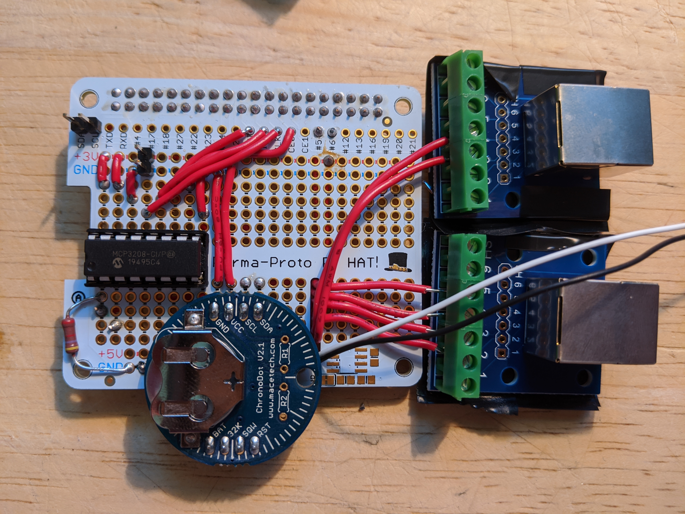

# Weather Station

## Overview

The object of this project is to provide a collection of Python modules for
various sensors to be connected to a Raspberry Pi to form a weather station
equipped with logging. It is based off of the tutorial found
[here](https://projects.raspberrypi.org/en/projects/build-your-own-weather-station)
and further customized.

## A Brief User's Guide

Here are some brief points for common use of the Weather Station:

To start the station and begin logging the weather readings, simply power
on the Raspberry Pi with the PiHAT securely on the GPIO pins, and an external
storage device plugged into one of the USB drives. When the Pi turns on, it
will automatically start logging the weather readings.

While the station is running, it will gather readings and log them every 15
minutes. These readings will be written to an external storage device at
`/mnt/usb1` if one is plugged in. If one is not connected to the Pi, the data
will be written to the SD card at
`/home/pi/WeatherStation/data/<date--time>.csv`. The data file
will be named as the date and time of when the station was started in the format
of `YYYY-MM-DD--HH-MM-SS.csv`. 

To retrieve the data, the Pi can be powered off and the external storage device
can be disconnected from the Pi. The data can then be transferred to another
computer for analysis. To begin logging again, simply plug the external storage
device back into the Pi and turn the Pi back on following the same steps above.

Additional documentation can be found below.

## Hardware

Raspberry Pi 3 Model B Board
* 40 GPIO Pins - [Pinout](https://pinout.xyz/#)

### Sensors

This project is set up to handle the following sensors:

* [BME280](https://www.diymore.cc/products/5pcs-bme280-digital-pressure-sensor-temperature-humidity-barometricbreakout-module-board-gy-bme280interface-5v?_pos=1&_sid=955bdf851&_ss=r) - Temperature, pressure, and humidity.
  * Provided by Diymore sensor. The address to access it is 0x76.
* [Wind / Rain Sensor Assembly](https://www.argentdata.com/catalog/product_info.php?products_id=145)
  * Provided by Argent Data Systems
  * [Datasheet](https://www.argentdata.com/files/80422_datasheet.pdf)

### Misc Parts

* [MCP3208](https://www.digikey.com/product-detail/en/microchip-technology/MCP3208-CI-P/MCP3208-CI-P-ND/305928) - 12 bit Analog to Digital Converter
  * Provided by Microchip Technology
  * [Datasheet](http://ww1.microchip.com/downloads/en/DeviceDoc/21298e.pdf)
* 16-pin DIL/DIP IC Socket
* 2 - 4.7 KOhm Through-hole Resistors
* 2 - 2-pin male headers
* [Adafruit Perma-Proto HAT for Pi Mini Kit - No EEPROM](https://www.adafruit.com/product/2310)
* 2 - [RJ11 Breakout Boards](http://www.mdfly.com/products/rj11-6p6c-connector-breakout-board-module-ra-screw-terminals.html)
* [3.4 x 3.4 x 2inch (85 x 85 x 50mm) Junction Box](https://www.amazon.com/Zulkit-Dustproof-Waterproof-Universal-Electrical/dp/B07Q1YBFLP/ref=asc_df_B07Q1YBFLP/?tag=hyprod-20&linkCode=df0&hvadid=344005018279&hvpos=&hvnetw=g&hvrand=4742956269277649464&hvpone=&hvptwo=&hvqmt=&hvdev=c&hvdvcmdl=&hvlocint=&hvlocphy=9029805&hvtargid=pla-807538012684&psc=1&tag=&ref=&adgrpid=69357499415&hvpone=&hvptwo=&hvadid=344005018279&hvpos=&hvnetw=g&hvrand=4742956269277649464&hvqmt=&hvdev=c&hvdvcmdl=&hvlocint=&hvlocphy=9029805&hvtargid=pla-807538012684)
  * This is for the BME280 Sensor
* [200 x 155 x 80mm Junction Box](https://www.amazon.com/YXQ-200mmx155mmx80mm-Electrical-Waterproof-Dustproof/dp/B01N4HZMSW/ref=sr_1_8?c=ts&dchild=1&keywords=Electrical+Boxes%2C+Conduits+%26+Fittings&qid=1613622299&refinements=p_n_feature_twenty_browse-bin%3A3267888011&s=lamps-light&sr=1-8&ts_id=6369359011)
  * This is to house the Raspberry Pi
* [ChronoDot 2.1 (DS3231 Chip) Real Time Clock](https://www.adafruit.com/product/255)

## Installation and Setup on a Raspberry Pi

This works well with the
[NOOBS Raspbian OS](https://www.raspberrypi.org/downloads/noobs/) 
installation. This was all tested with the Buster version of Raspbian on a
Raspberry Pi 3 Model B+.

In order to use the I2C and SPI interfaces, these have to be enabled. This can
be done by running `sudo raspi-config` and enabling I2C and SPI in the
`Interfacing Options`. A reboot is required for these to be fully enabled. This
can be done by running `sudo reboot`.

The project must be cloned to `/home/pi/` for the scripts to work correctly.
This can be done by running the following:

``` bash
git clone https://github.com/lightningWhite/WeatherStation.git
```

The project requires Python 3 to be installed. 

Once this repository is cloned, perform the following steps in the repository
directory:

Create a python virtual environment and activate it:

``` bash
python3 -m venv env
source env/bin/activate
```

Install the pip dependencies of the project (Note: Don't use sudo for the pip
installation in the virtual environment): 

``` bash
pip3 install -r requirements.txt
```

Install `tmux`:

``` bash
sudo apt-get update
sudo apt-get install tmux
```

The `install.sh` script when run will copy the necessary files to `/etc/init.d`
so the weather station will start on boot automatically. It will also create a
mount point and modify the fstab so an external USB storage device will be
automatically mounted on boot. It will also configure the Pi to automatically
connect to a network named `Weather` if present. This can be helpful if you want
to connect to the Pi wirelessly using a mobile hotspot. The script will also
configure the Pi to use the Real Time Clock for time. The script will also
install and configure Grafana to start up when the pi boots, and it sets up and
configures an InfluxDB database. This script must be run as root and the Pi must
be restarted for the changes to take effect:

``` bash
sudo ./install.sh
# The Pi must be rebooted before being able to set the hardware clock time.
sudo reboot
# Ensure the Pi reports the correct time with the 'date' command, and then
# write the time to the RTC module with this command
sudo hwclock -w
```

The barometric pressure sensor should be calibrated to sea level for the
location in which the weather station will be deployed. There is a calibration
value in the bme280_sensor.py script that that can be used to calibrate the
barometer. It is simply a value to be added or subtracted from the sensor's
reading. To determine what value to add or subtract from the reading, look up
the barometric reading from a local weather reporting agency, such as
Weather.com or Wunderground.com. You may need to convert the agency's reading
from inHg to millibars. Then find the difference between the weather agency's
reading and that which is reported by the sensor and add or subtract that
difference as needed from the sensor's reading.

## Running the Weather Station

The `startWeatherStation.sh` script will start a tmux session and call the
`initializeWeatherStation.sh` script. This script will source the python virtual
environment. It will then start the weather station and detach the tmux session. 
This makes it so the ssh session can time out or be terminated and the weather
station process will remain running. Using tmux also allows the user to attach
to the session at any time and view the real-time output of the program.

After the `startWeatherStation.sh` script has been executed, you can attach to
the process and view the output in real-time by typing `tmux attach`. To detach
from the session again so it can continue running when the ssh session times
out or you log out from it, type `Ctrl+b` and then `d`. This will put it in the
background to continue running.

Note that when the weather station has been started automatically on boot,
to view the real-time output of the weather station, you must attach to the
tmux session as root: `sudo tmux attach`.

When the weather station is started with the `startWeatherStation.sh` script,
the real-time output will be written to a log file by the name of the time the
weather station was started and be written to the /logs directory in the
repository. Log messages are written to stdout and should capture most of the
problems that may arise while the weather station is running. This can assist
in debugging.

## Real Time Clock

The Raspberry Pi can't keep accurate time when it's disconnected from the
internet. For this reason, we use a Real Time Clock (RTC) module. We've
chosen to use the ChronoDot 2.1. Note that the `install.sh` script will
configure the Pi to use the Real Time Clock. For completeness, the steps
performed are documented below. **However**, the only step that the `install.sh`
script does not do is set Real Time Clock's time. **This must be done for it
to be accurate.** This can be accomplished by running `sudo hwclock -w` while
the Pi has the correct time being displayed.

The following location provides a nice tutorial for setting up the Raspberry Pi
to use the RTC:

* [Adding a DS3231 Real Time Clock To The Raspberry Pi](https://www.raspberrypi-spy.co.uk/2015/05/adding-a-ds3231-real-time-clock-to-the-raspberry-pi/)

The following instructions come largely from the link above.

Ensure the following connections to the Raspberry Pi 3 Model B:

* GND of the RTC connected to pin 9 (Ground)
* VCC of the RTC connected to pin 17 (3v3 Power)
* SCL of the RTC connected to BCM 3 (SCL)
* SDA of the RTC connected to BCM 2 (SDA)

To view the I2C address of the RTC, the following command can be run:

```
sudo i2cdetect -y 1
```

This may show the addresses of other connected I2C devices, but the RTC address
will likely by 0x68.

The following line needs to be appended to the /etc/modules file:

```
rtc-ds3231
```

In order to synchronize the Raspberry Pi's time with the RTC when the Pi boots,
the following needs to be added to the `/etc/rc.local` file right before the
`exit 0` at the end: 

```
/bin/bash -c "echo ds3231 0x68 > /sys/class/i2c-adapter/i2c-1/new_device"
/sbin/hwclock -s
```

The Raspberry Pi should then be rebooted:

```
sudo reboot
```

The date and time reported by the Raspberry Pi can be viewed with the `date`
command. If the time needs to be manually set, it can be done with a command
such as the following:

```
sudo date -s "29 AUG 1997 13:00:00"
```

When the time is correctly set, the system date and time can be written to the
RTC module with the following command:

```
sudo hwclock -w
```

The time can then be read from the RTC with this command:

```
sudo hwclock -r
```

To verify that the system time and the RTC time is the same, the following
command can be run:

```
date; sudo hwclock -r
```

To verify that the RTC is correctly keeping time and that the Raspberry Pi
will use it when it boots, power down the Raspberry Pi, disconnect the
power cable, remove the network connection, connect the Pi to a monitor and
keyboard, leave it overnight, and then power it up and use "date" to
verify that the time reported is correct.

## Data Logging

As the weather station runs, it will log readings from all of the sensors at a
configurable rate. This can be set in the weather_station.py file. The
LOG_INTERVAL defines how often the readings will be logged. The
ACCUMULATION_INTERVAL defines how often samples should be taken of some of the
sensors in order to calculate and averages or maximums. The
ACCUMULATION_INTERVAL should be less than the LOG_INTERVAL.

A log file will be created every time the weather station is started and it
will be saved to `/home/pi/WeatherStation/data` if an external
storage device isn't connected and be named the date and time of when it was
created. If an external storage devices is connected, it will be logged to
`/mnt/usb1` where that device will automatically be mounted.

While data is being written to the data file, the current data file will be
copied to <data_filename>.csv.bak. Then the new data will be appended to the
original data file. After this is complete the .bak file will be removed. This
is done to prevent corruption if the Pi is unplugged while the file is being
written to.

Here is some sample data that was logged by the station:

```
Record Number, Time, Temperature (F), Pressure (mbar), Relative Humidity (%), Wind Direction (Degrees), Wind Direction (String), Wind Speed (MPH), Wind Gust (MPH), Precipitation (Inches)
1, 2020-05-16 16:38:54.100572, 67.8, 1014.3, 23.8, 256.5, WSW, 0.7, 2.5, 0.0
2, 2020-05-16 16:53:55.786168, 66.2, 1014.3, 24.0, 252.0, WSW, 0.5, 2.1, 0.0
3, 2020-05-16 17:08:56.629817, 65.8, 1014.1, 23.3, 255.5, WSW, 0.4, 3.1, 0.0
4, 2020-05-16 17:23:58.887251, 65.1, 1014.2, 24.5, 248.4, WSW, 0.3, 1.5, 0.0
5, 2020-05-16 17:38:59.409071, 65.1, 1014.2, 23.7, 295.7, WNW, 0.1, 0.9, 0.0

```

This can easily be viewed by opening the .csv file with a spreadsheet
application such as Microsoft Excel, LibreOffice Calc, or Google Sheets.

## Application Logging

The `weather_station.py` file initializes a logger. Log messages from the
weather station will be stored in the `logs` directory by
the same time name as the data file. This log output can be very helpful for
debugging if any issues arise. If an external storage device is connected,
the log file will be written to `/mnt/usb1` instead of the logs directory
in the repo directory. The log file will be cleared at the beginning of
every month to save disk space.

## Helpful Connection Information

In order to connect to the Raspberry Pi via ssh, it must be enabled first.
This resource provides some instructions on how to do that:

* https://www.raspberrypi.org/documentation/remote-access/ssh/

One of the methods mentioned is to have the Pi connected to a keyboard and
monitor and then run the following:

```
sudo systemctl enable ssh
sudo systemctl start ssh
```

Note that this can also be done using `raspi-config`.

A helpful tool for finding the IP address of the Raspberry Pi in order to
ssh to it, is `arp-scan`. It can be installed by running the following:

```
sudo apt-get install arp-scan
```

To list the IP addresses of devices on the network, run the following:

```
sudo arp-scan -l
```

### Connecting to the Raspberry Pi Using an Android Phone

#### termux

An Android app called `termux` can be installed from Google Play. This
app provides a terminal on the Android phone. Using this terminal, files
can be copied from the Raspberry Pi via `scp`. Connections can also be made to
the Pi using `ssh`. To do this, open termux on an Android phone and run the
following commands:

Enable tmux to access the phone's storage so you can access any copied files
from the Pi:

```
termux-setup-storage
```

Allow access when the dialog pops up.

Install ssh and scp:

```
pkg install openssh
```

You can now ssh to the Raspberry Pi using the Pi's IP address if you're on
the same network:

```
ssh pi@192.168.0.23
```

You can also copy one of the data files from the Pi to your phone with a
command such as this:

```
cd storage/downloads
scp pi@192.168.0.23:/home/pi/WeatherStation/data/05-07-2020--19-08-22.csv .
```

Enter the Raspberry Pi's password and the file should be copied to the phone.

The file should then be copied to the Downloads folder of the phone.

If you want to copy all of the data files to your phone, you can do so using
the wildcard such as this:

```
cd storage/downloads
scp -r pi@192.168.0.23:/home/pi/WeatherStation/data/ .
```

#### VNC Viewer - Remote Desktop

`VNC Viewer - Remote Desktop` can be installed via Google Play. Once this is
installed, a vncserver can be started on the Raspberry Pi. vncserver needs to
be enabled on the Pi before doing this. This can be done by running
`raspi-config` and selecting `Interfacing Options`. Then select VNC and
enable it.

Once it is enabled, a vncserver can be started by running the following:

```
vncserver :1
```

This will start the vncserver on port 5901.

Using the Android vnc client application, you can connect to the Pi by
entering the IP address of the Raspberry Pi followed by a :1 such as this:

```
192.168.0.23:1
```

This will provide the desktop GUI with which you can interact.

#### Connecting Using a WiFi Hotspot from an Android Phone

Since the Pi will likely be running in a location without WiFi, in order to
connect via the methods above, some sort of network needs to be in place. This
can be a mobile hotspot.

The Raspberry Pi can be configured to connect automatically to a WiFi hotspot.
Then the mobile device or another device connected to the same network can
ssh to the Pi or scp files from the Pi to the phone. Do the following to make
this possible:

Modify the `wpa_supplicant.conf` file located at `/etc/wpa_supplicant/` to
include the hotspot network and password. An example of what should be added
is as follows:

```
network={
  ssid="WeatherNetwork"
  psk="password"
  key_mgmt=WPA-PSK
  priority=20
}
```

The Raspberry Pi must be restarted for the changes to take effect.

This will cause the Raspberry Pi to automatically connect to a network with the
name of "WeatherNetwork" and use the password "password" if the network is
present. Setting the priority to 20 (some arbitrarily large number) should
ensure that it will be the first network that it will try to connect to. Note
that the `install.sh` script will configure this network connection when it is
run.

On the mobile device, set up a hotspot with that name and password and turn it
on. The Pi should automatically connect to the hotspot.

The mobile hotspot should show that one device is connected. To view the IP
address of the Raspberry Pi, open up a terminal in the phone using something
like Termux and type the following:

```
ip neigh
```

This should show the IP address of the Raspberry Pi on the hotspot network.

Any of the previously mentioned methods should now work to connect to the
Raspberry Pi using the mobile device.

## Weather Station Files

The following files are the primary files used in the weather station:

* weather_station.py - The main program loop
* bme280_sensor.py - Temperature, pressure, and humidity sensing
* wind_direction.py - Wind direction sensing

The following files are used for setting up and running the weather station:

* install.sh - Configures the Raspberry Pi to start the weather station on boot
* initializeWeatherStation.sh - Sources the Python3 virtual environment
* startWeatherStation.sh - Starts the weather station in a tmux session and
runs it in the background

The following files located in the `sensor_test_code` directory are used for
developmental and testing purposes, but the code from them is extracted into
the `weather_station.py` file. The documentation for these files is relevant
for the code used in the weather_station.py file:

* rainfall.py - Keeps track of precipitation
* vane_values.py - Utility file used for finding voltages to be mapped to
resistance values in for calculating the wind direction
* wind_speed.py - Calculates the wind speed

### Additional Documentation on Primary Weather Station Files 

#### weather_station.py

This file contains the main program loop. It contains all the code for the
weather station with the exception of the following files, which are imported:

* bme280_sensor.py
* wind_direction.py

As the weather station runs, it will gather and log readings from all of the
sensors at a configurable rate. The LOG_INTERVAL defines how often the readings
will be logged. The ACCUMULATION_INTERVAL defines how often samples should be
taken of some of the sensors in order to calculate and averages or maximums.
The ACCUMULATION_INTERVAL should be less than the LOG_INTERVAL.

#### bme280_sensor.py

This file interfaces with the BME280 sensor to report the following:

* Relative Humidity as a percentage.
* Barometric Pressure in millibars calibrated to an elevation.
* Temperature in Fahrenheit or Celsius

A flag is present that can be set true or false to report the temperature in
Celsius or Fahrenheit. 

There is also a calibration value that can be used to calibrate the barometer.
It is simply a value to be added or subtracted from the sensor's reading. To
determine what value to add or subtract from the reading, look up the 
barometric reading from a local weather reporting agency, such as Weather.com
or Wunderground.com. You may need to convert the agency's reading from inHg 
to millibars. Then find the difference between the weather agency's reading and
that which is reported by the sensor and add or subtract that difference as
needed from the sensor's reading.

Ensure the following connections to the Raspberry Pi 3 Model B:

* VIN of the BME280 sensor connected to pin 17 (3v3 Power)
* GND of the BME280 sensor connected to pin 9 (Ground)
* SCL of the BME280 sensor connected to BCM 3 (SCL)
* SDA of the BME280 sensor connected to BCM 2 (SDA)

See [https://projects.raspberrypi.org/en/projects/build-your-own-weather-station/2](https://projects.raspberrypi.org/en/projects/build-your-own-weather-station/2) for more information.

#### wind_direction.py

Ensure the following connections:

* Anemometer connected into the Wind Direction Sensor
* Wind Direction Sensor connected to the RJ11 connector
* Pin 2 on the RJ11 connector to 3v3
* Pin 5 on the RJ11 connector to pin 1 (CH0) on the MCP3208
* Pin 3 on the RJ11 connector to Ground (For the anemometer)
* Pin 4 on the RJ11 connector to BCM 5 (For the anemometer)
* Ground to pin 9 on the MCP3208 chip
* BCM 8 (CE0) to pin 10 (CS/SHDN) on the MCP3208 chip
* BCM 10 (MOSI) to pin 11 (Din) on the MCP3208 chip
* BCM 9 (MISO) to pin 12 (Dout) on the MCP3208 chip
* BCM 11 (SCLK) to pin 13 (CLK) on the MCP3208 chip
* Ground to pin 14 (AGND) on the MCP3208 chip
* 3v3 to pin 15 on (Vref) the MCP3208 chip
* 3v3 to pin 16 on (Vdd) the MCP3208 chip
* 4.7kohm resistor from ground to pin 1 on the MCP3208 chip for voltage 
division

See the vane_values.py documentation for more information about how this
file works.

#### logging.py

This file provides logging functionality. A path to the log file location is
passed to the intialize_logger function and then messages can then be logged
by calling the log function and passing a message. The message will be logged
with the current time.

### Developmental and Utility Files

The code from most of these files is extracted into the weather_station.py
file. The documentation for those code extracts is contained in each file
subsection below.

#### wind_speed.py

This file interfaces with the anemometer to record the wind speed and the wind
gust in miles per hour. It will read the wind speed every 30 seconds and store
the value. Every 15 minutes it will log the average wind speed recorded as
well as the highest speed (wind gust) recorded during the last 15 minutes.

The wind speed sensor's radius of 9.0 cm. is used to calculate the speed.

The datasheet indicates that the sensor should report a wind speed of 1.492 MPH
if the switch is closed once per second. Thus, to calibrate the sensor, first
modify the code so it prints the wind speed every 5 seconds and it calculates
the wind speed every 5 seconds. Then, rotate the sensor five times in the first
5 seconds and obtain the reading. If the reading is not 1.492, perform the 
following equation to determine the value that should be entered in for 
the `CALIBRATION` constant in the file:

```
CALIBRATION = 1.492 / reading
```

After adjusting the `CALIBRATION` factor in wind.py, repeating the test should
result in a reading of 1.492.

The datasheet for the anemometer can be found
[here](https://www.argentdata.com/files/80422_datasheet.pdf).


Ensure the following connections to the Raspberry Pi 3 Model B:

Pin 3 on the RJ11 connector to Ground
Pin 4 on the RJ11 connector to BCM 5

#### rainfall.py

This file interfaces with the rain sensor to calculate how much rain has fallen
in inches. It counts how many times the bucket has tipped, where each bucket
tip signifies 0.011 inches of rain.

Ensure the following connections to the Raspberry Pi 3 Model B:

* Pin 3 on the RJ11 connector to Ground
* Pin 4 on the RJ11 connector to BCM 6

#### vane_values.py

A helper script for calculating the Vout values for each of 16 resistance values
contained in the wind direction sensor. To run the script, ensure that the
connections specified for the wind_direction.py script are in place.

Each position of the wind vane results in a different resistance reading based
off of the reference voltage (3.3V) and the resistors in the voltage divider
circuit. The R2 value, chosen by us, is used to sufficiently separate the
voltage readings so they can be mapped to 16 specific directions.

The wind vane datasheet provides output voltages based off of a 5V reference
voltage. The Raspberry Pi logic levels are 3.3V, so we needed to recalculate
the voltages that map to each direction. This script is also used for finding
a suitable R2 value in our voltage divider circuit that separates the readings
sufficiently to differentiate between them.

For our uses, we've found that an R2 value of 4.7kohms works pretty well with
3.3 volts.

The wind direction sensor's resistance values mapped to the voltage values using
3.3V and 4.7kohms are as follows:

```
33000 0.4
6570 1.4
8200 1.2
891 2.8
1000 2.7
688 2.9
2200 2.2
1410 2.5
3900 1.8
3140 2.0
16000 0.7
14120 0.8
120000 0.1
42120 0.3
64900 0.2
21880 0.6
```

As an important side note, these voltage values mapped to headings came from
the Raspberry Pi weather station tutorial mentioned previously. However, the
voltages came  from an incorrect voltage divider equation. In the tutorial,
they used the following equation: vout = (vin * r1) / (r1 + r2)

It should have been the following: vout = (vin * r2) / (r1 + r2)

However, with a vin of 3v3 and the external resistor of 4.7kohms
(r1 in their equation), there are 16 different values, so it works.
Due to limited resources and time, I left it as they had it rather
than find a different resistor value that would also work.

The voltages found above are then mapped to various headings in degrees as
follows:

```
0.4: 0.0
1.4: 22.5 
1.2: 45.0 
2.8: 67.5
2.7: 90.0 
2.9: 112.5 
2.2: 135.0 
2.5: 157.5
1.8: 180.0 
2.0: 202.5 
0.7: 225.0 
0.8: 247.5
0.1: 270.0 
0.3: 292.5 
0.2: 315.0 
0.6: 337.5
```

### Board Assembly Notes

Referring to the Raspberry Pi Weather Station tutorial mentioned earlier can
be helpful, but since this weather station has several modifications, these
are some additional notes of what I did that may be helpful while assembling
the board. Remember to turn off the Pi before taking off or putting on the
Pi HAT board. Sometimes bugs can crop up by leaving the Pi on while doing this
that can take a good while to figure out.

* Refer to the pin connections in this readme and in the source files for
how and where everything should be connected.
* I would start with placing the MCP3208 chip socket. After this
is placed, connect all the wires that go from the Pi to the chip.
* Connect the wind speed and wind direction sensors. This requires the RJ11
breakout board. I found it helpful to string the wires from the Pi and the
MCP3208 to the breakout board under the board and up through the slot on the
HAT board. This kind of holds them in place. I placed the RJ11 breakout board
so it would sit on top of the Ethernet port of the Pi. When doing this, it's
extremely important to insulate the bottom of the RJ11 breakout board and/or
the top of the Ethernet and USB ports, otherwise the connections on the RJ11
board will ground out on the metal. I just used some electrical tape. Also,
I just strung the resistor from the chip's pin 1 to the ground rail near the
5V power rail. And, don't be tempted to use the 5V power rail by accident. Be
sure to test that the wind speed and wind direction sensors work. I tested them
by slightly modifying the code to print out the values obtained in the
respective files. Be sure to undo the changes when done testing.
* Connect the rain gauge. Like the others, I strung the wires from the Pi to
the RJ11 breakout board through the slot. I positioned the RJ11 connector to
sit on top of the USB ports. Remember to insulate the bottom of the RJ11
connector and/or the top of the USB ports.
* Solder on the two two-pin headers for the BME280 sensor. Make sure it works.
* Connect the Real Time Clock. This one is a little tricky because it needs
to be connected to the SDA and SCL pins which are already in use by the
BME280 sensor. I got around this by just soldering the end of the wires to the
stubs on the back of the Pi HAT of the two-pin header on those two pins. Take
care not to bridge the SDA and SCL pins when soldering the ends. Then I strung
it under over to the clock. I placed the clock between the ADC and the RJ11
connectors. Remember to test it out and set the clock. Again, make sure you
have the Pi off and start it after it's connected. Also, remember to follow
the set up instructions near the top of this readme to configure and set the
Real Time Clock.

#### Assembly Images

##### Step 1 

Solder on the IC socket, solder the wires from the pins to the IC socket,
solder the 2-pin headers, and solder on the resistor:


##### Step 2

Solder the wires that go to the RJ11 connectors and feed them through the slot
on the Pi-HAT. Connect them to the RJ11 connectors. Place electrical tape on
the bottoms of the RJ11 connectors to prevent shorts.




##### Step 3

Solder the Real Time Clock (RTC) into place.


Carefully solder the wires from the RTC to the pins sticking through for the SDA
and SCL connections. Make sure there are no solder bridges.


##### Step 4

Connect the BME-280 sensor to the 2-pin headers.


##### Step 5

Place labels on the RJ11 connectors.


##### Step 6

Place electrical insulating tape on the tops of the USB and ethernet ports
of the Raspberry Pi to prevent any unwanted shorts.


##### Step 7

With the Pi off, carefully place the Pi-HAT fully on the GPIO pins. Make sure
that header of the Pi-HAT is correctly on the pins. 

Screw the junction boxes to a board leaving the middle free for the vertical
T-post mounting plate. Velcro the EMF sensor, Pi, and BME-280 sensor in their
respective boxes. Connect the wires between them.


##### Step 8

Screw the T-Post vertical mounting plate to the front of the board in the
middle so the board will balance correctly. Pound the T-Post into the ground
in the desired location and put the board on the T-Post using the mounting
plate. Ensure that the junction boxes are facing North for additional protection
from the sun. Remove the bottom plug of the BME-280 sensor junction box so the
sensor can more accurately read the temperature and humidity. Place some screen
over the hole to prevent wasp nests.


##### Step 9

Mount the Wind, Direction, and Rain assembly to the T-Post using the screw
clips. Make sure the wind speed and direction devices are facing West and East.
Connect all the wires, plug in the power, ensure that everything started
correctly, and screw on the junction box covers. It may be beneficial to put
some silicone around the junction box plugs to improve water proofing.


## TODOs

* Although the station records the readings every 15 minutes, it is just
recording them every 15 minutes from when the station was started. This needs
to be changed so it will record the data every 15 minutes (or what ever the
configured interval is) from the start of the hour instead. 
